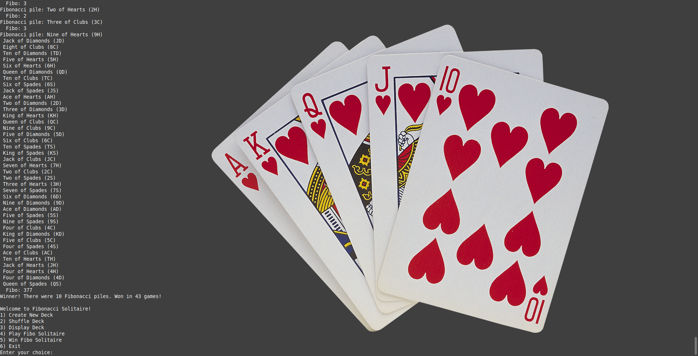

# Fibonacci Solitaire

A C++ powered simulation of the game "Fibonacci Solitaire," making use of object-oriented design to model card and deck behavior.



## Overview

This is one of my earliest projects, demonstrating a simulation of a card game called Fibonacci Solitaire, where piles of dealt cards are evaluated based on whether the sum of their card values forms a Fibonacci number.

This project was built to practice object-oriented design and simulation logic in C++. It reflects my ability to break down a problem and implement a complete interactive solution.

## Tech

This project demonstrates:

* Object-Oriented Programming
* Algorithms
* C++

## How It Works

* A standard 52-card deck is shuffled
* Cards are dealt one at a time into a pile
* The sum of the pile is recorded
* Whenever the sum is a Fibonacci number:
	* The pile is printed
	* The pile resets
* The game continues until all cards are dealt

You win if the final pile also forms a Fibonacci number. Otherwise, you lose.

## How to Run

### Compile:
g++ FiboSolitaire.cpp Deck.cpp Card.cpp -o fibo

### Run:
./fibo

## Highlights

### Fibonacci Function
The core of the project, the simple algorithm that checks if a given number is a part of the fibonacci sequence.

```cpp
bool isFibonacci(int n) {
	int a = 0, b = 1, c = 0;
	while (c < n) {
		c = a + b;
		a = b;
		b = c;
	}
	return c == n;
}
```

### Example Header
The project is organized using header files to detail the members of a class.

```cpp
#ifndef CARD_H
#define CARD_H

class Card
{
    public:
        Card(); // Default Constructor.
        Card(char r, char s);
        void setCard(char r, char s);
        int getValue() const;
        void show() const;

    private:
        char rank;
        char suit;
};

#endif
```

## What I Learned
* Designing modular classes for C++ programs
* Translating mathematical concepts into program logic.
* Implementing and managing multiple objects.